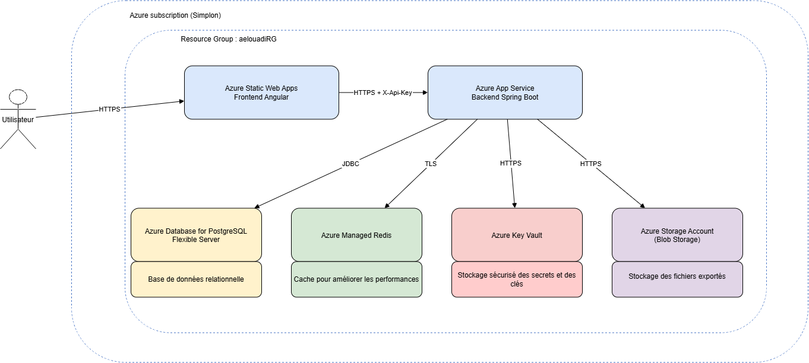

# Azure Quiz - Infrastructure Terraform

Infrastructure as Code du projet **Azure Quiz**.

Ce dépôt contient la configuration Terraform utilisée pour provisionner et configurer l'environnement **non-production Azure** de l'application.

Le projet applicatif est réparti en trois dépôts :

- `bilan-azure-quiz-frontend` : frontend Angular ;
- `bilan-azure-quiz-backend` : API Spring Boot ;
- `bilan-azure-quiz-terraform` : infrastructure Azure.

---

## Architecture

L'application utilise principalement des **services managés Azure**.

L'architecture comprend :

- Azure Static Web Apps pour le frontend Angular ;
- Azure Linux Web App pour le backend Spring Boot ;
- App Service Plan mutualisé fourni dans le cadre de la formation ;
- Azure Database for PostgreSQL Flexible Server ;
- Azure Managed Redis ;
- Azure Storage Account et Blob Storage ;
- Azure Key Vault ;
- Managed Identity et RBAC ;
- règles réseau permettant de contrôler l'accès aux services de données.

### Schéma d'architecture



Le schéma représente l'architecture conçue initialement pour le projet.

L'architecture réellement déployée a ensuite été adaptée à certaines contraintes rencontrées dans l'environnement Azure mutualisé de formation. Ces évolutions sont détaillées dans la section **Évolution de l'architecture réseau**.

---

## Vue simplifiée de l'architecture finale

```text
                        Internet
                           |
                           v
                Azure Static Web Apps
                   Frontend Angular
                           |
                           | HTTPS / REST
                           | X-Api-Key
                           | CORS restreint
                           v
              +-----------------------------+
              | App Service Plan mutualisé  |
              | plan-npr-prf2026            |
              |                             |
              | Azure Linux Web App         |
              | Backend Spring Boot         |
              +-----------------------------+
                   |          |          |
                   |          |          |
                   v          v          v
              PostgreSQL    Redis    Blob Storage
                                      quiz-files
                           |
                           v
                       Key Vault
```

---

## Évolution de l'architecture réseau

L'architecture initiale prévoyait une isolation réseau stricte reposant notamment sur :

- un Virtual Network ;
- des subnets ;
- une intégration réseau du backend ;
- des mécanismes d'accès privés aux services Azure.

Lors de l'implémentation, des contraintes liées à l'**App Service Plan mutualisé fourni pour la formation** ont nécessité une adaptation de cette architecture.

L'architecture finale conserve donc un backend disposant d'une URL publique, avec plusieurs mécanismes de contrôle complémentaires :

- CORS limité à l'origine exacte du frontend Azure Static Web Apps ;
- clé API partagée pour protéger les endpoints `/api/**` ;
- règles réseau sur les services de données ;
- autorisation des IP sortantes nécessaires de l'App Service ;
- Managed Identity pour le backend ;
- RBAC pour l'accès au Blob Storage.

Cette solution correspond à l'exception prévue dans le cahier des charges pour la cible **Services managés** lorsque l'isolation réseau stricte du backend n'est pas possible.

La décision est documentée dans :

```text
docs/adr/ADR-006-network-strategy.md
```

---

## Ressources Azure

### Resource Group

Les ressources applicatives sont regroupées dans :

```text
aelouadiRG
```

### Frontend

Le frontend Angular est hébergé avec :

```text
Azure Static Web Apps
```

URL non-production :

```text
https://gentle-moss-091704803.7.azurestaticapps.net
```

### Backend

Le backend Spring Boot est hébergé dans une :

```text
Azure Linux Web App
```

URL :

```text
https://app-quiz-backend-aelouadi.azurewebsites.net
```

Le backend utilise l'App Service Plan mutualisé :

```text
plan-npr-prf2026
```

### PostgreSQL

La base de données utilise :

```text
Azure Database for PostgreSQL Flexible Server
```

Elle contient les données applicatives et constitue la source de vérité du backend.

### Redis

Le cache applicatif repose sur :

```text
Azure Managed Redis
```

Le backend utilise une connexion sécurisée TLS dans l'environnement Azure.

### Storage Account

Le projet utilise un Azure Storage Account pour le stockage Blob.

Storage Account :

```text
staquizelouadi
```

Conteneur utilisé par le backend :

```text
quiz-files
```

Les résultats des quiz peuvent y être exportés au format JSON.

### Key Vault

Azure Key Vault est utilisé pour la gestion des informations sensibles nécessaires à l'application.

Les secrets ne sont pas stockés directement dans le code source.

---

## Managed Identity et RBAC

L'Azure Linux Web App possède une **System Assigned Managed Identity**.

Cette identité permet au backend d'accéder à certaines ressources Azure sans stocker de credentials permanents dans l'application.

Pour Blob Storage, l'identité du backend dispose du rôle approprié permettant l'accès aux données Blob.

Cette approche permet d'éviter l'utilisation d'une clé du Storage Account directement dans le backend.

---

## Configuration du backend

Terraform configure les App Settings nécessaires au backend, notamment :

```text
SPRING_PROFILES_ACTIVE
SPRING_DATASOURCE_URL
SPRING_DATASOURCE_USERNAME
SPRING_DATASOURCE_PASSWORD
REDIS_HOSTNAME
REDIS_PORT
REDIS_PASSWORD
REDIS_SSL_ENABLED
STORAGE_ACCOUNT_NAME
STORAGE_CONTAINER_NAME
BACKEND_API_KEY
APP_CORS_ALLOWED_ORIGINS
```

Le profil Spring Boot utilisé dans Azure est :

```text
prod
```

---

## CORS et accès au backend

Le frontend et le backend sont hébergés sur deux origines différentes.

Le backend autorise uniquement l'origine du frontend non-production :

```text
https://gentle-moss-091704803.7.azurestaticapps.net
```

Les appels vers `/api/**` utilisent également une clé API partagée transmise avec :

```http
X-Api-Key
```

Cette configuration permet de renforcer le contrôle d'accès malgré l'exposition publique nécessaire du backend.

---

## Organisation Terraform

L'infrastructure est organisée en modules afin de séparer les responsabilités.

Exemple de structure :

```text
.
├── .github/
│   ├── workflows/
│   └── dependabot.yml
├── docs/
│   ├── adr/
│   ├── architecture.drawio
│   └── architecture.png
├── modules/
│   ├── app-service/
│   ├── frontend/
│   ├── key-vault/
│   ├── postgresql/
│   ├── redis/
│   └── storage/
├── main.tf
├── variables.tf
├── outputs.tf
├── providers.tf
├── versions.tf
└── README.md
```

Les modules permettent de rendre l'infrastructure plus lisible, maintenable et réutilisable.

---

## Backend Terraform distant

Le state Terraform est stocké dans un **backend Azure Blob Storage distant**.

Cela évite de conserver le fichier `terraform.tfstate` localement ou de le versionner dans Git.

Le backend distant permet également de bénéficier du mécanisme de verrouillage du state lors des opérations Terraform.

---

## Utilisation de Terraform

### Initialisation

```bash
terraform init
```

### Formatage

```bash
terraform fmt -recursive
```

### Validation

```bash
terraform validate
```

### Plan

```bash
terraform plan
```

### Application

```bash
terraform apply
```

Avant toute application d'un plan, les changements proposés doivent être contrôlés afin d'éviter la destruction involontaire de ressources.

---

## Tags Azure

Les ressources sont identifiées avec des tags permettant notamment leur découverte par les pipelines CI/CD.

Les workflows applicatifs peuvent ainsi retrouver les ressources Azure nécessaires **par tags**, plutôt que de coder leurs noms directement dans les pipelines.

Parmi les tags utilisés :

```text
Owner = aelouadi
Project = Azure-Quiz
```

Cette stratégie réduit le couplage entre les workflows GitHub Actions et les noms physiques des ressources Azure.

---

## CI/CD Terraform

Le dépôt utilise **GitHub Actions**.

Les workflows sont stockés dans :

```text
.github/workflows/
```

### Pipeline Terraform

Le workflow Terraform assure les contrôles et opérations nécessaires sur l'infrastructure.

Il permet notamment d'exécuter les étapes de validation Terraform dans la CI.

### Authentification Azure

GitHub Actions s'authentifie auprès d'Azure avec **OpenID Connect (OIDC)**.

Les GitHub Actions Secrets nécessaires sont notamment :

```text
AZURE_CLIENT_ID
AZURE_TENANT_ID
AZURE_SUBSCRIPTION_ID
```

Une Federated Credential Azure autorise GitHub Actions à obtenir un token temporaire.

Aucun client secret Azure permanent n'est donc nécessaire dans GitHub.

---

## Sécurité CI

Le workflow :

```text
.github/workflows/security.yml
```

exécute deux contrôles de sécurité.

### Trivy

Trivy analyse la configuration Terraform :

```text
scan-type: config
```

Le pipeline échoue lorsqu'une vulnérabilité ou mauvaise configuration de sévérité :

```text
HIGH
CRITICAL
```

est détectée.

### Gitleaks

Gitleaks analyse le dépôt et son historique Git afin de détecter d'éventuels secrets accidentellement committés.

Les scans sont exécutés sur :

- les push vers `main` ;
- les Pull Requests vers `main`.

---

## Pre-commit

Le dépôt utilise également des hooks **pre-commit**.

Configuration :

```text
.pre-commit-config.yaml
```

Ils permettent d'exécuter localement plusieurs contrôles avant l'enregistrement d'un commit.

L'objectif est de détecter certaines erreurs avant même l'exécution de la CI.

---

## Dependabot

Dependabot est configuré dans :

```text
.github/dependabot.yml
```

Il surveille notamment :

- les providers Terraform ;
- les GitHub Actions.

Les mises à jour peuvent ainsi être proposées automatiquement par Pull Request.

---

## Gouvernance Git

Le dépôt applique plusieurs mécanismes de gouvernance :

- branche `main` protégée via les règles GitHub ;
- Pull Requests avant intégration dans `main` ;
- commits signés et vérifiés (`Verified`) ;
- `CODEOWNERS` pour définir les propriétaires du code ;
- Dependabot ;
- scans de sécurité ;
- pre-commit ;
- CI automatisée.

---

## Architecture Decision Records

Les principales décisions techniques sont documentées dans :

```text
docs/adr/
```

ADR disponibles :

```text
ADR-001-terraform.md
ADR-002-platform-choice.md
ADR-003-terraform-backend.md
ADR-004-github-oidc.md
ADR-005-cicd.md
ADR-006-network-strategy.md
```

Ces ADR documentent notamment :

- le choix de Terraform ;
- le choix des services Azure managés ;
- le stockage distant du state ;
- l'authentification GitHub Actions avec OIDC ;
- la stratégie CI/CD ;
- l'évolution de la stratégie réseau.

---

## Gouvernance et sécurité des ressources Azure

Plusieurs mécanismes sont utilisés afin de limiter l'exposition des ressources :

- secrets gérés hors du code source ;
- Azure Key Vault ;
- Managed Identity ;
- RBAC ;
- CORS restreint ;
- clé API applicative ;
- règles réseau sur les services de données ;
- authentification OIDC pour les pipelines ;
- détection automatique de secrets ;
- scan IaC.

---

## Dépôts du projet

Le projet est séparé en trois dépôts :

```text
bilan-azure-quiz-frontend
bilan-azure-quiz-backend
bilan-azure-quiz-terraform
```

### Frontend

Contient :

- l'application Angular ;
- le pipeline Azure Static Web Apps ;
- la documentation applicative frontend.

### Backend

Contient :

- l'API Spring Boot ;
- les migrations Flyway ;
- les tests ;
- le pipeline de déploiement App Service ;
- la documentation applicative backend.

### Terraform

Ce dépôt contient :

- la définition de l'infrastructure Azure ;
- les modules Terraform ;
- les règles de sécurité et d'accès ;
- les ADR ;
- le schéma d'architecture ;
- les pipelines de validation et de déploiement de l'infrastructure.
